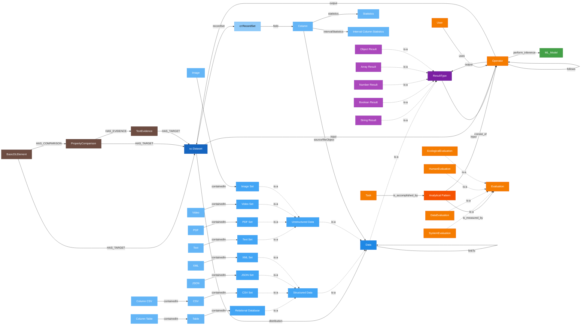

# MoMa Management API

[](https://github.com/datagems-eosc/moma-management/commits/main)
[](LICENSE)

## Overview

The **MoMa Management API** manages CRUD operations on MoMa, a data-flow graph. It handles **datasets**, **analytical patterns (APs)**, **dataset relationships**, **tasks**, **ML models**, **evaluations**, and individual graph **nodes**, backed by a Neo4j property graph store.

## Graph Data Model

The diagram below shows all MoMa node types and their relationships. Solid arrows are graph edges stored in Neo4j; dashed arrows denote type-hierarchy ("is-a") specialisations.

### Nodes

| Node | Description |
|------|-------------|
| `sc:Dataset` | Top-level dataset descriptor (Schema.org) |
| `Data` | Generic data distribution node; specialised by sub-types below |
| `RelationalDatabase`, `CsvSet`, `JSONSet`, `XMLSet` | Structured data container types |
| `TextSet`, `PDFSet`, `VideoSet`, `ImageSet` | Unstructured data container types |
| `Table`, `CSV`, `JSON`, `XML`, `Text`, `PDF`, `Video`, `Image` | Leaf-level data items |
| `ColumnTable`, `ColumnCSV`, `Column` | Column-level descriptors within relational or CSV data |
| `Statistics` | Column statistics node |
| `IntervalColumnStatistics` | Column statistics computed over a specific time window (streaming datasets) |
| `cr:RecordSet` | Croissant record-set node |
| `Analytical_Pattern` | Root node of an Analytical Pattern subgraph |
| `Operator` | Single processing step within an AP |
| `ResultType` | Base typed value exchanged between Operators (transient or persistent) |
| `StringResult` | String-typed `ResultType` |
| `BooleanResult` | Boolean-typed `ResultType` |
| `NumberResult` | Number-typed `ResultType` |
| `ArrayResult` | Array-typed `ResultType` (optional JSON schema fragment) |
| `ObjectResult` | Object-typed `ResultType` (optional JSON schema fragment) |
| `ML_Model` | Registered machine-learning model |
| `Task` | Scientific task that can be fulfilled by one or more APs |
| `User` | User who triggers or configures an Operator |
| `Evaluation` | Base evaluation record for an AP execution |
| `SystemEvaluation` | Evaluation of system-level metrics (e.g. latency, throughput) |
| `DataEvaluation` | Evaluation of data-quality metrics |
| `HumanEvaluation` | Evaluation produced by human annotators |
| `EcologicalEvaluation` | Evaluation of ecological / environmental impact |
| `BasicDLElement` | Root node of a Dataset Relationship: links exactly two `sc:Dataset` nodes found similar by an external dataset-linking pipeline |
| `PropertyComparison` | Compares one specific property (e.g. keywords, description) between the two linked datasets |
| `TextEvidence` | Backs a `PropertyComparison` with a specific piece of textual evidence (e.g. a matching chunk) |

> **What is a Dataset Relationship?** A **Dataset Relationship** (a.k.a. "dataset linking") is a small subgraph produced by an external comparison pipeline — not by users — that records *why* two datasets were found to be similar. Its root `BasicDLElement` node links exactly two `sc:Dataset` nodes; optional `PropertyComparison` children break the similarity down by dataset property (keywords, description, …), each optionally backed by `TextEvidence` (the specific text chunk that was compared). A relationship is a **weak reference**: only admins can create or delete one, browsing it requires `BROWSE` access on *both* linked datasets, at most one relationship may exist per dataset pair, and deleting either dataset automatically deletes the relationship. See the "Dataset Relationships" API section below.



| Colour | Domain |
|--------|--------|
| 🟦 Blue | Dataset & Data nodes |
| 🟢 Green | ML Model |
| 🟠 Orange | Analytical Pattern, Operators, Evaluation, Task & User |
| 🟣 Purple | ResultType and its subtypes |
| 🟤 Brown | Dataset Relationship (dataset linking) |

### Edges

| Edge | From | To | Description |
|------|------|----|-------------|
| `distribution` | `sc:Dataset` | `Data` | A dataset exposes a data distribution |
| `recordSet` | `sc:Dataset` | `cr:RecordSet` | A dataset exposes a Croissant record set |
| `linkTo` | `Data` | `Data` | A data node references another data node |
| `containedIn` | `Data` / sub-types | `Data` / sub-types | Child points to its container (e.g. `CSV → CsvSet`, `ColumnTable → Table`) |
| `field` | `cr:RecordSet` | `Column` / `PDF` | Record set declares a column or PDF field |
| `source/fileObject` | `Column` | `Data` | Column is sourced from a file object |
| `source/fileSet` | `PDF` | `Data` | PDF field is sourced from a file set |
| `statistics` | `Column` | `Statistics` | Column links to its computed statistics |
| `intervalStatistics` | `Column` | `IntervalColumnStatistics` | Column links to statistics computed over a specific time window (streaming datasets) |
| `consist_of` | `Analytical_Pattern` | `Operator` | AP is composed of operator steps |
| `input` | `ResultType` or `sc:Dataset` | `Operator` | Data flows into an Operator; `Data` (persistent) and transient subtypes (`StringResult`, etc.) are valid `ResultType` sources; `sc:Dataset` is also valid for whole-dataset references (mapping is Any — not checked at AP design time) |
| `output` | `Operator` | `ResultType` or `sc:Dataset` | Operator writes a typed value; same targets as `input` |
| `follows` | `Operator` | `Operator` | Operator executes after another operator |
| `uses` | `User` | `Operator` | User triggers or configures an operator |
| `perform_inference` | `Operator` | `ML_Model` | Operator runs inference against an ML model |
| `is_accomplished_by` | `Task` | `Analytical_Pattern` | Task is fulfilled by an AP |
| `is_measured_by` | `Analytical_Pattern` | `Evaluation` | AP links to its evaluation record(s) |
| `HAS_COMPARISON` | `BasicDLElement` | `PropertyComparison` | Dataset Relationship root → a per-property similarity breakdown (`weight` edge property) |
| `HAS_EVIDENCE` | `PropertyComparison` | `TextEvidence` | Property comparison → supporting text evidence (`rank` edge property) |
| `HAS_TARGET` | `BasicDLElement`, `PropertyComparison`, or `TextEvidence` | `sc:Dataset` | Links a Dataset Relationship node to one of the two datasets it concerns (`chunk`/`similarityScore` edge properties) |

## Quick Start

Just run the .devcontainer provided. 
Once inside the devcontainer, you can then install the dependencies like so

```sh
uv sync --all-groups

```

And run the project :
```sh
# You can also use the debug configuration if you are using vscode
uv run python moma_management/main.py
```

Once launched, the API is available here
**Interactive docs:** http://localhost:5000/docs

## Running the container

The `Dockerfile` exposes two build targets:

```bash
# Run the test suite
docker build --target test -t moma-test .
docker run moma-test

# Build and run the production image
docker build --target prod -t moma-api .
docker run -p 5000:5000 \
  -e NEO4J_URI=bolt://<host>:7687 \
  -e NEO4J_USER=neo4j \
  -e NEO4J_PASSWORD=secret \
  moma-api
```

## Configuration

Configuration is managed entirely through environment variables:

| Variable                  | Required | Default                              | Description                                                              |
| ------------------------- | -------- | ------------------------------------ | ------------------------------------------------------------------------ |
| `NEO4J_URI`               | yes      | `bolt://localhost:7687`              | Neo4j Bolt connection URI                                                |
| `NEO4J_USER`              | yes      | `neo4j`                              | Neo4j username                                                           |
| `NEO4J_PASSWORD`          | yes      | `datagems`                           | Neo4j password                                                           |
| `MAPPING_FILE`            | no       | `moma_management/domain/mapping.yml` | Path to the Croissant → PG-JSON field mapping                            |
| `ROOT_PATH`               | no       | *(empty)*                            | ASGI root path (useful when behind a reverse proxy)                      |
| `OIDC_ISSUER`             | no       | *(empty)*                            | OIDC issuer URL for JWT validation (auth disabled if unset)              |
| `OIDC_CLIENT_ID`          | no*      | *(empty)*                            | OIDC client ID for token exchange¹                                       |
| `OIDC_CLIENT_SECRET`      | no*      | *(empty)*                            | OIDC client secret for token exchange¹                                   |
| `OIDC_EXCHANGE_SCOPE`     | no*      | *(empty)*                            | Scope for exchanged tokens (e.g., `dg-app-api`)¹                         |
| `JWKS_TTL_SECONDS`        | no       | `300`                                | How long to cache the JWKS from the OIDC issuer (seconds)                |
| `PROFILING`               | no       | `false`                              | Set to `true` to enable the request profiling middleware                  |
| `PERMISSIONS_GATEWAY_URL` | no       | *(empty)*                            | External gateway URL for dataset-level authorization (disabled if unset) |
| `EMBEDDER_MODEL`          | no       | `all-MiniLM-L6-v2`                  | Sentence-transformers model for AP semantic search (set empty to disable) |
| `APP_PORT`                | no       | `5000`                               | TCP port the Uvicorn server listens on                                    |
| `APP_CONCURRENCY`         | no       | `1`                                  | Number of Uvicorn worker processes                                        |
| `OTEL_SERVICE_NAME`       | no       | `moma-management`                    | Service name reported to the OTel backend                                |
| `OTEL_TRACES_EXPORTER`    | no       | `none`                               | Trace exporter; set to `otlp` to enable tracing once a collector endpoint is available |
| `OTEL_METRICS_EXPORTER`   | no       | `none`                               | Metrics export is disabled — unreliable across multiple Uvicorn workers  |
| `OTEL_LOGS_EXPORTER`      | no       | `none`                               | Log export is disabled — the app already ships structured JSON logs to stdout |
| `OTEL_EXPORTER_OTLP_ENDPOINT` | no   | *(empty)*                            | OTLP collector endpoint (`host:port`); if unset, traces are dropped/logged as export errors — set by the deployment environment |

*¹ These three variables must be set together to enable token exchange. Required only if using token exchange for the permissions gateway.*

## Observability

Traces are enabled via OpenTelemetry's zero-code auto-instrumentation, which wraps the production entrypoint (`opentelemetry-instrument python moma_management/main.py`, see the `prod` stage of the `Dockerfile`). The app's Uvicorn worker processes are started via Python's `multiprocessing` `spawn` start method (not `os.fork()`), so each worker is a fresh interpreter that independently re-triggers auto-instrumentation on startup — this sidesteps the [pre-fork server issues](https://opentelemetry.io/docs/zero-code/python/troubleshooting/#pre-fork-server-issues) that affect classic `os.fork()`-based servers like gunicorn, and matches OpenTelemetry's own documented compatibility table for plain multi-worker Uvicorn (traces and logs are reliable; metrics are not).

Tracing is opt-in: `OTEL_TRACES_EXPORTER=none` by default, since exporting to an unreachable/unconfigured collector produces periodic connection-error log noise without breaking anything (the exporter runs on a background thread and never blocks request handling). Set `OTEL_TRACES_EXPORTER=otlp` and `OTEL_EXPORTER_OTLP_ENDPOINT` once a collector is available. Metrics and logs export stay explicitly disabled even then (`OTEL_METRICS_EXPORTER=none`, `OTEL_LOGS_EXPORTER=none`) — metrics because OpenTelemetry's `PeriodicExportingMetricReader` background thread is not reliable across multiple worker processes, and logs because the app already ships structured JSON logs to stdout via `structlog` (see `moma_management/logger.py`), and enabling OTel's log exporter would stand up a redundant second pipeline.

Known gap: the Neo4j async driver has no official/community OpenTelemetry instrumentor, so spans cover FastAPI/ASGI request handling and outbound `requests` calls (e.g. permissions gateway, OIDC token exchange) but not individual Neo4j queries.

Note: when `PROFILING=true`, the profiling middleware replaces the normal response body with an HTML profiling report — the resulting trace span will reflect that HTML response rather than the real API response, so it's not meant to be combined with production trace sampling.

## API Endpoints

### Datasets (`/datasets`)

| Method   | Path                  | Description                                             |
| -------- | --------------------- | ------------------------------------------------------- |
| `POST`   | `/datasets`           | Create a dataset from a PG-JSON body                    |
| `POST`   | `/datasets/croissant` | Ingest a Croissant profile → store as PG-JSON in Neo4j  |
| `GET`    | `/datasets`           | List datasets with filtering and pagination             |
| `GET`    | `/datasets/{id}`      | Retrieve the full dataset subgraph by ID                |
| `DELETE` | `/datasets/{id}`      | Delete a dataset and its connected subgraph             |
| `POST`   | `/datasets/convert`   | Convert a Croissant profile to PG-JSON (no persistence) |
| `POST`   | `/datasets/validate`  | Validate a PG-JSON dataset against the MoMa schema      |

#### `GET /datasets` query parameters

| Parameter       | Type                 | Default | Description                  |
| --------------- | -------------------- | ------- | ---------------------------- |
| `nodeIds`       | `string[]`           | `[]`    | Filter by node IDs           |
| `properties`    | `DatasetProperty[]`  | `[]`    | Filter by dataset properties |
| `types`         | `NodeLabel[]`        | `[]`    | Filter by node label         |
| `mimeTypes`     | `MimeType[]`         | `[]`    | Filter by MIME type          |
| `orderBy`       | `DatasetSortField[]` | `[]`    | Sort fields                  |
| `direction`     | `ASC` \| `DESC`      | `ASC`   | Sort direction               |
| `publishedFrom` | `date`               | —       | Published date lower bound   |
| `publishedTo`   | `date`               | —       | Published date upper bound   |
| `status`        | `Status`             | —       | Filter by dataset status     |
| `page`          | `int ≥ 1`            | `1`     | Page number                  |
| `pageSize`      | `1–100`              | `25`    | Items per page               |

### Dataset Relationships (`/datasets/relationships`, `/datasets/{id}/relationships`)

A Dataset Relationship ("dataset linking") records that two datasets were found similar by an external comparison pipeline — see the description under [Graph Data Model](#graph-data-model) above. Relationships are automatically generated by other components rather than authored by end users, so write access is admin-only.

| Method   | Path                             | Description                                                                    |
| -------- | --------------------------------- | ------------------------------------------------------------------------------ |
| `POST`   | `/datasets/relationships`         | Create a relationship between exactly two existing datasets (admin only)       |
| `GET`    | `/datasets/relationships/{id}`    | Retrieve a relationship by its root node ID (`BROWSE` on both linked datasets)  |
| `DELETE` | `/datasets/relationships/{id}`    | Delete a relationship (admin only)                                             |
| `GET`    | `/datasets/{id}/relationships`    | List every relationship targeting dataset `{id}` (`BROWSE` on `{id}`; results linking to a dataset the caller can't browse are omitted) |

RBAC and lifecycle rules:

- **Create/Delete**: realm role `dg_admin` / `dg_dataset-curator` / `dg_system` only.
- **Get**: caller must hold the `dg_ds-browse` grant on **both** datasets the relationship links.
- **Uniqueness**: at most one relationship may exist per (unordered) dataset pair — creating a duplicate returns `409 Conflict`.
- **Cascading delete**: deleting either linked dataset automatically deletes the relationship (relationships are a *weak* reference — their absence never implies datasets are unrelated).

### Analytical Patterns (`/aps`)

| Method   | Path             | Description                                            |
| -------- | ---------------- | ------------------------------------------------------ |
| `POST`   | `/aps`           | Create an AP (caller must be able to browse input datasets) |
| `GET`    | `/aps`           | List APs (supports semantic search via `q` parameter)  |
| `GET`    | `/aps/{id}`      | Retrieve an AP by root node ID                         |
| `DELETE` | `/aps/{id}`      | Delete an AP (leaves referenced dataset nodes intact; cascades to linked Evaluations)  |
| `POST`   | `/aps/validate`  | Validate a PG-JSON AP against the MoMa schema          |

### Evaluations (`/aps/{ap_id}/evaluations`, `/aps/evaluations`)

| Method   | Path                                       | Description                                                       |
| -------- | ------------------------------------------ | ----------------------------------------------------------------- |
| `POST`   | `/aps/{ap_id}/evaluations`                 | Create an Evaluation for an AP execution                          |
| `GET`    | `/aps/{ap_id}/evaluations`                 | List Evaluations for an AP (filterable by `execution_id`, `dimension`) |
| `GET`    | `/aps/evaluations/{execution_id}`          | Retrieve the full Evaluation snapshot by execution ID             |
| `DELETE` | `/aps/evaluations/{execution_id}`          | Delete an Evaluation by execution ID                              |

#### `GET /aps/{ap_id}/evaluations` query parameters

| Parameter      | Type                | Default | Description                              |
| -------------- | ------------------- | ------- | ---------------------------------------- |
| `execution_id` | `string`            | —       | Filter to a specific execution ID        |
| `dimension`    | `EvaluationDimension` | —     | Filter to evaluations containing this dimension (`system`, `data`, `human`, `ecological`) |

#### `GET /aps` query parameters

| Parameter   | Type    | Default | Description                                    |
| ----------- | ------- | ------- | ---------------------------------------------- |
| `q`         | string  | —       | Natural-language query for semantic search      |
| `top_k`     | 1–100   | `10`    | Max results to return                           |
| `threshold` | 0.0–1.0 | `0.0`   | Minimum similarity score                        |

### Tasks (`/tasks`)

| Method | Path              | Description                                      |
| ------ | ----------------- | ------------------------------------------------ |
| `POST` | `/tasks`          | Create a new Task node                           |
| `GET`  | `/tasks/{id}/aps` | Get AP IDs accomplished by a task                |

### Nodes (`/nodes`)

| Method  | Path          | Description                                     |
| ------- | ------------- | ----------------------------------------------- |
| `GET`   | `/nodes/{id}` | Retrieve a single graph node by ID              |
| `PATCH` | `/nodes/{id}` | Partially update properties of an existing node |

### ML Models (`/ml-models`)

| Method   | Path              | Description                                                 |
| -------- | ----------------- | ----------------------------------------------------------- |
| `POST`   | `/ml-models`      | Create a new ML_Model (admin only)                          |
| `GET`    | `/ml-models`      | List all ML_Models (any authenticated user)                 |
| `GET`    | `/ml-models/{id}` | Retrieve an ML_Model by ID (any authenticated user)         |
| `PATCH`  | `/ml-models/{id}` | Update an ML_Model (admin only)                             |
| `DELETE` | `/ml-models/{id}` | Delete an ML_Model (admin only, blocked if referenced by AP)|

### Health

| Method | Path      | Description                             |
| ------ | --------- | --------------------------------------- |
| `GET`  | `/health` | Returns `200 OK` when the service is up |

## Project Structure

```
moma_management/
├── main.py                    # FastAPI app entry point (port 5000)
├── di.py                      # Dependency injection (Neo4j driver, auth, service wiring)
├── api/v1/
│   ├── datasets/              # Dataset endpoints (includes nested relationships/ sub-routes)
│   ├── analytical_patterns/   # AP endpoints
│   ├── nodes/                 # Node endpoints
│   ├── tasks/                 # Task endpoints
│   └── ml_models/             # ML Model endpoints
├── services/
│   ├── dataset.py             # Dataset CRUD + Croissant ingestion
│   ├── dataset_relationship.py # DatasetRelationship CRUD (existence + uniqueness checks)
│   ├── analytical_pattern.py  # AP CRUD + semantic search
│   ├── evaluation.py          # Evaluation CRUD
│   ├── node.py                # Node CRUD
│   ├── task.py                # Task CRUD
│   ├── ml_model.py            # ML Model CRUD + delete protection
│   ├── authentication.py      # JWT validation (OIDC/JWKS, RS256)
│   ├── authorization.py       # Dataset-level permission checks via external gateway
│   └── embeddings/            # Sentence-transformer embedder for AP search
├── domain/
│   ├── pg_json_graph.py       # Base class for validated PG-JSON graphs
│   ├── dataset.py             # Dataset model
│   ├── dataset_relationship.py # DatasetRelationship model (root links exactly two datasets)
│   ├── analytical_pattern.py  # AnalyticalPattern model
│   ├── evaluation.py          # Evaluation domain model (EvaluationDimension enum, Evaluation, EvaluationRecord)
│   ├── schema_validator.py    # JSON-Schema validation with AJV-style errors
│   ├── filters.py             # Query filter / pagination models
│   ├── mapping_engine.py      # Croissant → PG-JSON conversion logic
│   ├── mapping.yml            # Field mapping configuration
│   ├── generated/             # Pydantic v2 models (generated via `make gen`)
│   └── schema/                # JSON Schema source files
├── repository/
│   ├── dataset/               # Dataset repository (Neo4j)
│   ├── dataset_relationship/  # DatasetRelationship repository (Neo4j)
│   ├── analytical_pattern/    # AP repository (Neo4j + vector index)
│   ├── evaluation/            # Evaluation repository (Neo4j)
│   ├── node/                  # Node repository (Neo4j)
│   ├── task/                  # Task repository (Neo4j)
│   └── ml_model/              # ML Model repository (Neo4j)
└── legacy/
    └── converters.py          # Deprecated converters (kept for reference)
```

## Testing

Tests use [testcontainers](https://testcontainers-python.readthedocs.io/) to spin up a Neo4j instance automatically.

```bash
# Install all dependency groups
uv sync --all-groups

# Run the full test suite (4 parallel workers)
uv run pytest
```

## Updating the Moma model
To update the MoMa model, two step are involved.

First, update the json schema in `domain/schema`.

For example, let's add a new property to the `data` node 
```jsonc
// domain/schema/nodes/data.schema.json
{
    "$schema": "http://json-schema.org/draft-07/schema#",
    "title": "Data",
    "type": "object",
    "properties": {
        "id": {
            "type": "string"
        },
        "type": {
            "type": "string",
            "enum": [
                "Data"
            ]
        },
        "name": {
            "type": "string"
        },
        "description": {
            "type": "string"
        },
        "contentSize": {
            "type": "string"
        },
        "contentUrl": {
            "type": "string",
            "format": "uri"
        },
        "encodingFormat": {
            "type": "string"
        },
        "sha256": {
            "type": "string"
        },
        // THIS IS NEW
        "myProp": {
            "type": "thing"
        }
    },
    "required": [
        "id",
        "type"
    ]
}
```

We can then update the pydantic models using:

```sh
make gen
```

This will recreate the `domain/generated/nodes/data_schema.py` with the updated property

```py
class Type(Enum):
    data = 'Data'


class Data(BaseModel):
    id: str
    type: Type
    name: str | None = None
    description: str | None = None
    content_size: str | None = Field(None, alias='contentSize')
    content_url: AnyUrl | None = Field(None, alias='contentUrl')
    encoding_format: str | None = Field(None, alias='encodingFormat')
    sha256: str | None = None
    my_prop: str | None = None = Field(None, alias='myProp')
```

The second step is map this property from the Croissant format to the MoMa format. 
To achieve this, we must edit `domain/mapping.yml`. Croissant `Data` maps to a `Distribution` Moma node in this case.

```yml
Distribution:
  properties:
    type:           "@type"
    name:           name
    description:    description
    encodingFormat: encodingFormat
    contentSize:    contentSize
    contentUrl:     contentUrl
    sha256:         sha256
    # NEW
    # myProp is the name of the property we've added
    # myCroissantProp is the name of the property we want to map to in the croissant format
    myProp:         myCroissantProp
```

## Authentication & Authorization

The MoMa Management API supports optional JWT-based authentication and authorization:

- **Authentication** – When `OIDC_ISSUER` is set, all endpoints require a valid Bearer token (JWT). Tokens are validated using RS256 signatures from the OIDC issuer's JWKS endpoint.
- **Token Exchange** – If `OIDC_CLIENT_ID`, `OIDC_CLIENT_SECRET`, and `OIDC_EXCHANGE_SCOPE` are configured, incoming tokens are exchanged for a scope-specific token to be used with the permissions gateway.
- **Authorization** – When `PERMISSIONS_GATEWAY_URL` is set, the service queries the gateway to verify the caller's permission for each operation. Dataset endpoints check `CREATE`, `BROWSE`, `DELETE`, or `EDIT` grants. AP endpoints require `BROWSE` on the referenced input datasets. Task endpoints require authentication only (no RBAC). Validate and convert endpoints are public.

**Development mode:** Leave `OIDC_ISSUER` and `PERMISSIONS_GATEWAY_URL` unset to disable both authentication and authorization (useful for local testing).

See [Security](docs/docs/security.md) for details. The [auth.http](auth.http) file provides examples for testing auth flows locally.

## Documentation

Full documentation is available at: https://datagems-eosc.github.io/moma-management/

