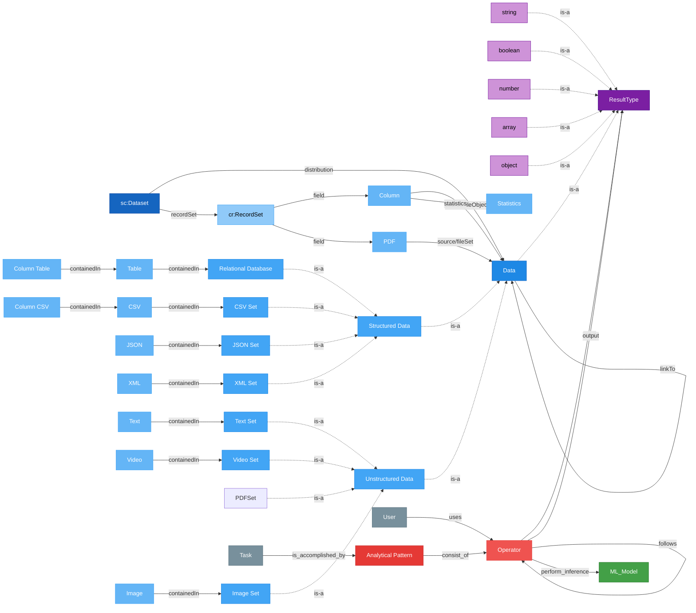
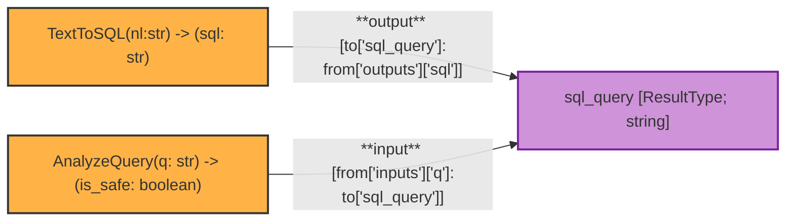
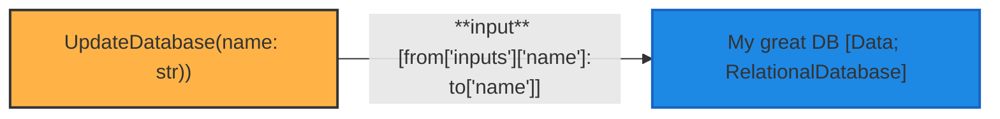
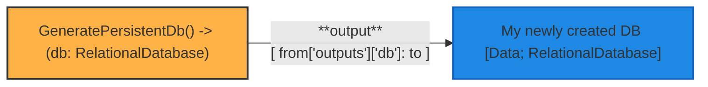
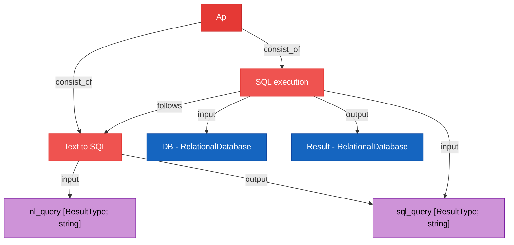

# Design Proposal : Operator Input / Output

## Definition

**MoMa** : Hybrid ETL pipelines storage system. Represent data, action and Machine learning in a single storage.

**Analytical Pattern (AP)** : Heart of the MoMa model. A reusable workflow/dataflow that serves as a communication languages between building blocks of Datagems.

**Operator** : High-level function transforming a set of input into a set of outputs 

**Volatile result**: Non-persistent result. Will be used throughout the document.

## Motivation

As more APs are created, the need to properly specify what an Operator consumes and produces becomes critical. This document discusses the structured definition of Operator inputs and outputs, and how data flows between Operators through Datasets.

## Current Design Limitation

Today, neither the Operator schema nor the Dataset schema capture what data actually flows through the pipeline:

<details>

<summary> Operator Specification </summary>
```jsonc
// Operator_schema.spec.json
// Source : https://github.com/datagems-eosc/moma-management/blob/d4e4600eb85c5edd9228d4d87c8f62f6c1a03014/moma_management/domain/schema/nodes/ap/operator.schema.json
// Viewed on 2026/04/13
{
    "$schema": "http://json-schema.org/draft-07/schema#",
    "$id": "operator.schema.json",
    "title": "Operator",
    "allOf": [
        {
            "$ref": "../node.schema.json"
        }
    ],
    "type": "object",
    "description": "An Operator node represents a single processing step within an AnalyticalPattern. Specialisations (e.g. SQL_Operator) add further properties.",
    "properties": {
        "id": {
            "type": "string",
            "format": "uuid"
        },
        "type": {
            "type": "string",
            "enum": [
                "Operator"
            ]
        },
        "name": {
            "type": "string",
            "description": "Human-readable name of the operator"
        },
        "description": {
            "type": "string",
            "description": "What this operator does"
        },
        "command": {
            "type": "string",
            "description": "Executable command or function name"
        },
        "step": {
            "type": "integer",
            "description": "Ordinal position in a sequence of operators"
        },
        "startTime": {
            "type": "string",
            "description": "Optional operator-level start time"
        }
    },
    "required": [
        "id",
        "type",
        "name"
    ]
}
```

</details>

<details>

<summary> Dataset Specification </summary>

```jsonc
// Dataset_schema.spec.json
// Source : https://github.com/datagems-eosc/moma-management/blob/d4e4600eb85c5edd9228d4d87c8f62f6c1a03014/moma_management/domain/schema/nodes/dataset/dataset.schema.json
// Viewed on 2026/04/21
{
    "$schema": "http://json-schema.org/draft-07/schema#",
    "title": "Dataset",
    "type": "object",
    "properties": {
        "id": {
            "type": "string",
            "description": "Unique identifier of the dataset"
        },
        "type": {
            "type": "string",
            "enum": ["sc:Dataset"],
            "description": "Node type discriminator"
        },
        "name": {
            "type": "string",
            "description": "Human-readable name of the dataset"
        },
        "description": {
            "type": "string",
            "description": "Full description of the dataset"
        },
        "datePublished": {
            "type": "string",
            "format": "date",
            "description": "Publication date (ISO 8601: YYYY-MM-DD)"
        },
        "version": {
            "type": "string",
            "description": "Version string of the dataset"
        },
        "license": {
            "type": "string",
            "description": "License under which the dataset is published"
        },
        "url": {
            "type": "string",
            "format": "uri",
            "description": "Canonical URL of the dataset"
        },
        "keywords": {
            "type": "array",
            "items": { "type": "string" },
            "description": "Descriptive keywords for discovery and search"
        },
        "status": {
            "type": "string",
            "enum": ["draft", "published", "loaded", "archived"],
            "description": "Lifecycle status of the dataset"
        },
        "archivedAt": {
            "type": "string",
            "description": "Storage location of the archived dataset (e.g. S3 URI)"
        }
    },
    "required": [
        "id",
        "type"
    ]
}
```

</details>

We don't see anything about :
- What's the **input** of an Operator ?
- What's the **output** of an Operator ?

Also, the operators uses the **Data** object to pass results to one another. The object in Data are member of persistent Dataset that must be created into Datagems. 
This is a by-design decision that allows to reuse results between executions.
However, what if we want to pass volatile data that has no benefit being registered into Datagems ?
  
This creates questions on :
- How to pass **structured** results between Operators ?
- How to both represent **intermediate volatile data** and **persistent result** in a workflow ?  

## Proposed Changes

The first change that must be done is to allow an Operator to handle both **Persistent** (Existing behavior) and **Volatile** results. 

### Updating the Graph Data Model

The diagram below extends the MoMa schema with the `ResultType` node. The `Data` node and each JSON Schema type (`string`, `boolean`, `number`, `array`, `object`) specialise `ResultType` (dashed "is-a" arrows), and Operator input/output edges now point to `ResultType` rather than `Data` directly.



| Colour          | Domain                               |
| --------------- | ------------------------------------ |
| 🟦 Blue shades   | Dataset & Data nodes                 |
| 🟥 Red shades    | Analytical Pattern & Operators       |
| 🟩 Green         | ML Model                             |
| ⬜ Grey          | Task & User                          |
| 🟣 Purple shades | ResultType & scalar subtypes *(new)* |

### JSON Schema type system

Parameters and result values are typed using JSON Schema types.

| Type      | Description                                                                                                                                                                                                |
| --------- | ---------------------------------------------------------------------------------------------------------------------------------------------------------------------------------------------------------- |
| `string`  | -                                                                                                                                                                                                          |
| `boolean` | -                                                                                                                                                                                                          |
| `number`  | -                                                                                                                                                                                                          |
| `array`   | List of values. Use `items` to type homogeneous lists (`"items": "string"`). Untyped `array` is valid for heterogeneous lists.                                                                             |
| `object`  | Structured value. Can carry an inline JSON Schema (`properties`, `required`, `additionalProperties`) in the Operator parameter definition. Opaque use (no `properties`) is valid for untyped pass-through. |

### Operator input and output parameters 

Each Operator is modelled as a function with a typed signature:

$f(x_1, ..., x_n) \rightarrow  y_1...y_m$

Where:
- $x_1...x_n$ are the input parameters of the Operator *f*
- $y_1...y_m$ are the output parameters of the Operator *f*

As in a programming language, the **AP template** must define for each operator and for each parameter :
- The **name** of the parameter, used within the operator
- The **type** of the parameter, expressed as a JSON Schema type (see [JSON Schema type system](#json-schema-type-system))
- Whether the parameter is **required** (Allowing pseudo-[variadic](https://en.cppreference.com/w/c/variadic.html) input)
- The optional **default value** of the parameter.


```jsonc
{
    "id": "<uuid>",
    "labels": ["Operator", "Op_1"],
    "properties": {
        // Operator signature versioning
        "version": "1.0.0",
        ...
        "inputs":[
            {
                "name": "p1",
                "type": "string",
                "required": true,
                "default": ""
            }
        ],
        "outputs":[
            {
                "name": "r1",
                "type": "string",
                "required": true,
                "default": ""
            }
        ]
    }
}
```

### ResultType node

A `ResultType` is the base node type for any value exchanged between Operators. Both `Data` and JSON Schema types (`string`, `boolean`, `number`, `array`, `object`) are concrete subtypes of `ResultType`  each identified by its second label in the graph.

**When to use each subtype:**

| Subtype                                                 | Use when                                                                                                                                                                                           |
| ------------------------------------------------------- | -------------------------------------------------------------------------------------------------------------------------------------------------------------------------------------------------- |
| **scalar `ResultType`** (`string`, `boolean`, `number`) | Non-persistent, single primitive value. Each output parameter gets its own node.                                                                                                                   |
| **`array` `ResultType`**                                | Non-persistent, small homogeneous list.                                                                                                                                                            |
| **`object` `ResultType`**                               | Non-persistent, small structured value with inline JSON Schema.                                                                                                                                    |
| **`Data`**                                              | Any persistent or large data (existing behavior). Any subtype of Data can be used for easier type checking. |

A `ResultType` node carries:
- `id` : UUID
- `type` : one of `"string"`, `"boolean"`, `"number"`, `"array"`, `"object"`, `"Data"`
- `name`  the logical name of the value in the graph (required for concrete subtypes, optional on the base)

The concrete type is encoded as the second label for efficient graph filtering. Only `array` and `object` subtypes carry an additional `schema` property (a JSON Schema fragment describing their structure). 

Scalar subtypes (`string`, `boolean`, `number`) have no `schema` field.

```jsonc
// scalar
{
    "id": "<uuid>",
    "labels": ["ResultType", "string"],
    "properties": {
        "name": "sql_query"
    }
}
```

```jsonc
// typed array 
{
    "id": "<uuid>",
    "labels": ["ResultType", "array"],
    "properties": {
        "name": "results",
        "schema": { "type": "array", "items": { "type": "string" } }
    }
}
```

```jsonc
// structured object 
{
    "id": "<uuid>",
    "labels": ["ResultType", "object"],
    "properties": {
        "name": "metadata",
        "schema": {
            "type": "object",
            "properties": {
                "code": { "type": "string" },
                "message": { "type": "string" }
            },
            "required": ["code"]
        }
    }
}
```

```jsonc
// Data type
{
    "id": "<uuid>",
    "labels": ["ResultType", "Data", "Relational_Database"],
    "properties": {
        ...
    }
}
```


### Mapping with edges

Mappings define how data flows between Operators and ResultType nodes.

This is required as operators can define whatever names and types for their parameters 
```bash 
# Example 1 : Naming 
Op_1(i_1: str, i_2: str) -> (r_1:str, r_2:str)
Op_2(j_1: str, j_2: str) -> (s_1:str, s_2:str)

# Let's say result r_1 of Op_1 correspond to parameter j_1 of Op_2, how to represent that ?

# Example 2: Types (Advanced, Future-proofing)
Op_1(...) -> (r_1: array)
Op_2(j_1: str) -> (...)

# Now j_1 of Op_2 is the first element of r_1 of Op_1. How to represent it ?


```
The mapping has two goals:
- Be as simple as possible 
- Be flexible to be able to be extended 

Taking the PG-JSON graph structure into account we can use the `input` and `output` edges between an `Operator` and a `ResultType` to represent the mapping.
Using this, the mapping syntax can use the existing `from` and `to` properties from the edges to map data like this :

```json
// On an input edge, "from" is the Operator, "to" is the ResultType
{
    "from": "<uuid>",
    "to": "<uuid",
    "labels": ["input"],
    "properties": {
        "mappings": [
            // We want to set the value of the Operator input parameter (from)
            // equiv. from["properties"]["inputs"]['<target_key1>'] = to["properties"][<target_key2>]
            "from['inputs']['<target_key1>']": "to['<target_key2>']"
        ]
    }
    
}
```

```json
// On an output edge, "from" is the Operator, "to" is the ResultType 
{
    "from": "<uuid>",
    "to": "<uuid",
    "labels": ["output"],
    "properties": {
        "mappings": [
            // We want to set the value of the ResultType (to)
            // equiv. to["properties"][<target_key1>] = from["properties"]["outputs"]['<target_key2>']
            "to['<target_key1>']": "from['outputs']['<target_key2>']"

        ]
    }
    
}
```

Some syntax notes :
- The `from` and `to` properties always refers to the node `properties`. So `to['<target_key>']` is equivalent to `to["properties"][<target_key>]`. 
- This should makes each data channel in the pipeline explicit and type-safe.


**Example 1 : Volatile data through a ResultType node**

The TextToSql operator generates an output `sql_query` that is consumed by the `AnalyzeQuery` operator as input `q`. This can be represented as follows:



**Example 2 : Using Persistent data through a Data node**

In this example, the `UpdateDatabase` operator takes as input a `name` parameter that is the name of the database to update. This database is represented as a `Relational_Database` node in Moma. The mapping between the `name` parameter of the operator and the `name` property of the `Relational_Database` node can be represented as follows:



**Example 3 : Outputting a Data node**

In this example, the `GeneratePersistentDb` operator generates a new database in MoMa. The mapping between the output of the operator and the `Relational_Database` node in Moma can be represented as follows:


**Important** : The operator is still responsible to create the Data node in Moma. The mapping syntax only allows to check for structural correctness, it won't catch runtime errors.

#### Opening the way for JSONPath expressions

The mapping syntax may allow futures extensions of this implementation to support [JSONPath (RFC 9535)](https://www.rfc-editor.org/rfc/rfc9535) expressions, alongside some utilities functions as [other solutions do](https://learn.microsoft.com/en-us/azure/logic-apps/expression-functions-reference). This could allow syntax such as :

```json
// On an output edge, "from" is the Operator, "to" is the ResultType 
// On an input edge, "from" is the ResultType, "to" is the Operator
{
    "from": "<uuid>",
    "to": "<uuid",
    "labels": ["input"],
    "properties": {
        "mappings": [
            // Assign the first element of the returned array
            "to['<target_key>']": "from['<target_key>'][0]"
            // Negating boolean returned from the previous Operator
            "to['<target_key>']": "not(from['<target_key>'])"
        ]
    }
    
}
```

**Important** : This extension will **not** be implemented by this proposal.


## A complete example : A NL Query execution AP

Let's now do a complete example. 
The purpose of this AP is to take in a natural language query and execute it as an SQL statement.



### Operators definitions

Operators must define the shape of their inputs and outputs so the execution layer can map properties between them.

#### Text To SQL Operator

```jsonc
{
    "id": "<uuid>",
    "labels": ["Text_To_SQL_Operator", "Operator"],
    "properties": {
        "version": "1.0.0",
        // Input of the Operator, what must be passed to it for it to function properly
        "inputs":[
            {
                "name": "nl",
                "type": "string",
                "required": true
            }
        ],
        // What the output of operator looks like
        "outputs":[
            {
                "name": "query",
                "type": "string",
                "required": true
            }
        ]
    }
}
```

#### SQL Execution Operator

```jsonc
{
    "id": "<uuid>",
    "labels": ["SQL_Query_Operator", "Operator"],
    "properties": {
        "version": "1.0.0",
        // Input of the Operator, what must be passed to it for it to function properly
        "inputs":[
            {
                "name": "sql",
                "type": "string",
                "required": true
            },
            {
                "name": "db",
                "type": "RelationalDatabase",
                "required": true
            }
        ],
        // What the output of operator looks like
        "outputs":[
            {
                "name": "result",
                "type": "RelationalDatabase",
                "required": true
            }
        ]
    }
}
```

### Nodes

There are four nodes exchanged in this AP.

#### nl_query (ResultType; string)

The natural language question entered by the user. Modelled as a scalar `ResultType` — it is a transient string value, not a persistent dataset.

```jsonc
{
    "id": "<uuid_rt_nl>",
    "labels": ["ResultType", "string"],
    "properties": {
        "name": "nl_query"
    }
}
```

#### sql_query (ResultType; string)

The SQL statement produced by `Text to SQL` and consumed by `SQL Execution`. Also a transient scalar `ResultType`.

```jsonc
{
    "id": "<uuid_rt_sql>",
    "labels": ["ResultType", "string"],
    "properties": {
        "name": "sql_query"
    }
}
```

#### DB (Data; RelationalDatabase)

The relational database against which the SQL query is executed. This is a persistent `Data` node — it exists independently of the AP.

```jsonc
{
    "id": "<uuid_ds_db>",
    "labels": ["RelationalDatabase", "Data"],
    "properties": {
        "name": "DB"
    }
}
```

#### Result (Data; RelationalDatabase)

The output of `SQL Execution` — the query result set, stored as a relational `Data` node.

```jsonc
{
    "id": "<uuid_ds_result>",
    "labels": ["RelationalDatabase", "Data"],
    "properties": {
        "name": "Result"
    }
}
```

### Mapping definitions 

Mappings define how data flows:
  - From ResultType node → Operator input (scalar: mapping required)
  - From Operator output → ResultType node (scalar: mapping required)
  - From/to Data node → Operator (no mapping: the whole node is passed)

In a real use case, this mapping could be done during AP design, for example via drag-and-drop, using parameter types to ensure compatibility.

All edges go **from the Operator** to the Data/ResultType node. The label (`input` / `output`) describes the role from the Operator's perspective.

#### input edge (Text to SQL → nl_query ResultType)

```jsonc
// Text to SQL reads the 'nl_query' value from the ResultType node into its 'nl' input
{
    "from": "<Text_To_SQL>",
    "to": "<nl_query_RT>",
    "labels": ["input"],
    "properties": {
        "mappings": {
            "from['inputs']['nl']": "to['nl_query']"
        }
    }
}
```

#### output edge (Text to SQL → sql_query ResultType)

```jsonc
// Text to SQL writes its 'query' output into the sql_query node
{
    "from": "<Text_To_SQL>",
    "to": "<sql_query_RT>",
    "labels": ["output"],
    "properties": {
        "mappings": {
            "to['sql_query']": "from['outputs']['query']"
        }
    }
}
```

#### input edge (SQL Execution → sql_query ResultType)

```jsonc
// SQL Execution reads the sql_query node into its 'sql' parameter
{
    "from": "<SQL_Execution>",
    "to": "<sql_query_RT>",
    "labels": ["input"],
    "properties": {
        "mappings": {
            "from['inputs']['sql']": "to['sql_query']"
        }
    }
}
```

#### input edge (SQL Execution → DB)

```jsonc
// No mapping needed — the whole Data node is passed as 'db'
{
    "from": "<SQL_Execution>",
    "to": "<DS_DB>",
    "labels": ["input"]
}
```

#### output edge (SQL Execution → Result)

```jsonc
// No mapping needed — the whole Data node is written as output
{
    "from": "<SQL_Execution>",
    "to": "<DS_RESULT>",
    "labels": ["output"]
}
```

## Limitations && Open Questions
- Mapping definition could have special functions like `aggregate`, `collapse`. The set of supported transform functions is not yet defined. Candidates, semantics, and validation rules need to be specified.
- Allowing both an `object` ResultType with inline JSON Schema and a `Data` node might lead to some antipatterns. For example, a user might be tempted to use an `object` ResultType to pass a large structured data between operators, which is not the intended use. Clear guidelines and best practices should be established to avoid such misuse.
- Error handling is not yet specified. What to do when an operator fails ?
    + Proposition: every Operator has an implicit reserved `_error` output (never declared, always present) of type `object` with fields `code: string` and `message: string` (`code` required). An AP could route `_error` to a dedicated error-handling Operator to enable conditional error branches without special graph constructs.

## Appendix

<details>

<summary> Full Example AP </summary>

```jsonc
{
  "nodes": [
    {
      "id": "<ap_template_uuid>",
      "labels": [
        "Analytical_Pattern"
      ],
      "properties": {
        "name": "NL Query Execution",
        "description": "AP Template to transform a natural language query into SQL and execute it"
      }
    },
    {
      "id": "<op1_uuid>",
      "labels": [
        "Operator",
        "Text_To_SQL"
      ],
      "properties": {
        "name": "Text to SQL",
        "version": "1.0.0",
        "step": 1,
        "inputs": [
          {
            "name": "nl",
            "type": "string",
            "required": true
          }
        ],
        "outputs": [
          {
            "name": "query",
            "type": "string",
            "required": true
          }
        ]
      }
    },
    {
      "id": "<op2_uuid>",
      "labels": [
        "Operator",
        "SQL_Execution"
      ],
      "properties": {
        "name": "SQL Execution",
        "version": "1.0.0",
        "step": 2,
        "inputs": [
          {
            "name": "sql",
            "type": "string",
            "required": true
          },
          {
            "name": "db",
            "type": "RelationalDatabase",
            "required": true
          }
        ],
        "outputs": [
          {
            "name": "result",
            "type": "RelationalDatabase",
            "required": true
          }
        ]
      }
    },
    {
      "id": "<rt_nl_uuid>",
      "labels": ["ResultType", "string"],
      "properties": {
        "name": "nl_query"
      }
    },
    {
      "id": "<rt_sql_uuid>",
      "labels": ["ResultType", "string"],
      "properties": {
        "name": "sql_query"
      }
    },
    {
      "id": "<ds_db_uuid>",
      "labels": ["RelationalDatabase", "Data"],
      "properties": {
        "name": "DB"
      }
    },
    {
      "id": "<ds_result_uuid>",
      "labels": ["RelationalDatabase", "Data"],
      "properties": {
        "name": "Result"
      }
    }
  ],
  "edges": [
    {
      "from": "<ap_template_uuid>",
      "to": "<op1_uuid>",
      "labels": ["consist_of"]
    },
    {
      "from": "<ap_template_uuid>",
      "to": "<op2_uuid>",
      "labels": ["consist_of"]
    },
    {
      "from": "<op2_uuid>",
      "to": "<op1_uuid>",
      "labels": ["follows"]
    },
    {
      "from": "<op1_uuid>",
      "to": "<rt_nl_uuid>",
      "labels": ["input"],
      "properties": {
        "mappings": {
          "from['inputs']['nl']": "to['nl_query']"
        }
      }
    },
    {
      "from": "<op1_uuid>",
      "to": "<rt_sql_uuid>",
      "labels": ["output"],
      "properties": {
        "mappings": {
          "to['sql_query']": "from['outputs']['query']"
        }
      }
    },
    {
      "from": "<op2_uuid>",
      "to": "<rt_sql_uuid>",
      "labels": ["input"],
      "properties": {
        "mappings": {
          "from['inputs']['sql']": "to['sql_query']"
        }
      }
    },
    {
      "from": "<op2_uuid>",
      "to": "<ds_db_uuid>",
      "labels": ["input"]
    },
    {
      "from": "<op2_uuid>",
      "to": "<ds_result_uuid>",
      "labels": ["output"]
    }
  ]
}
```
</details>
