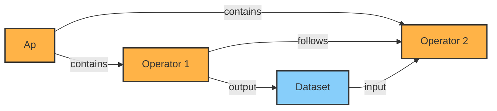
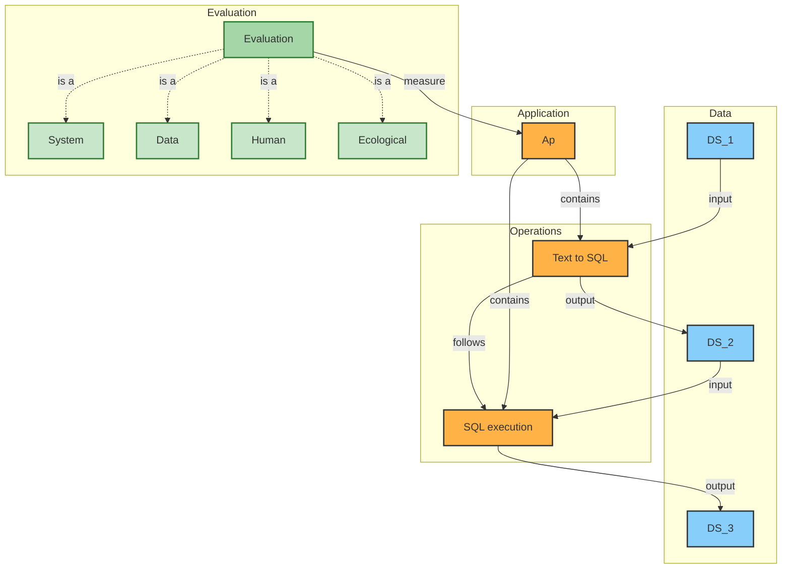

# Design Proposal : AP Template vs AP Instance

## Definition

**MoMa** : Hybrid ETL pipelines storage system. Represent data, action and Machine learning in a single storage.

**Analytical Pattern (AP)** : Heart of the MoMa model. A reusable workflow/dataflow that serves as a communication languages between building blocks of Datagems.

**Operator** : High-level function transforming a set of input into a set of outputs 

## Motivation

As more APs are created, the topic of proper differentiation between an AP Template and an AP Instance begins to surface. Today, we use "AP" interchangeably for both notions, which introduces several design considerations.

The main questions this document will try to answers are :
- What is actually stored in MoMa ?
- What's the difference between an AP Template and an AP instance ?
  
## Current Design Limitation



The blurry distinction between Template and Instance introduces questions such as:
- Is the AP stored in MoMa the reusable definition, or the specific execution ?
- Where do intermediate results live ?
- How do we re-run the same pipeline with different inputs without duplicating its structure ?

## Proposed Changes / Definitons

### AP Template

An **AP Template** is a stateless data pipeline defining :
- The source(s) of data for the pipeline
- The sequence of steps (Operators) transforming the data 
- The **structure** of input/output of each step 
- Is persistent (Stored in MoMa)

### AP Instance

An **AP Instance** is a stateful execution of an AP Template:
- Instantiates the input parameters of each step following the template logic
- Has execution variables :
  - an execution state (Done, In-Progress, Pending...) 
  - a current step (Operator 1, Operator n...)
  - a collection of intermediary results from previous steps 
- Is volatile (not stored in MoMa)

### Evaluation

An **Evaluation** is a persistent record stored in MoMa that captures the assessment of one AP execution against its AP Template:
- Is linked to the AP Template it was produced from (one Template -> many Evaluations)
- Stores the evaluation dimensions of that execution (**TBD**)
- Is created after an AP Instance completes its run
- Is persistent (stored in MoMa)

### Summary

|                    | AP Template                                   | AP Instance                                               | Evaluation                                    |
| ------------------ | --------------------------------------------- | --------------------------------------------------------- | --------------------------------------------- |
| **Nature**         | Stateless definition                          | Stateful execution                                        | Post-execution assessment                     |
| **Stored in MoMa** | Yes                                           | No                                                        | Yes                                           |
| **Contains**       | Operator structure, Dataset schemas, Mappings | Runtime parameters, intermediate results, execution state | Evaluation dimensions (TBD), link to Template |
| **Reusable**       | Yes, with different inputs                    | No, tied to a single run                                  | No, record of a past run                      |

## Example : A NL Query execution AP

The purpose of this AP is to take in a natural language query and execute it as an SQL statement.

### Analytical Pattern Template (stored in MoMa)

This flow represents the AP Template stored in MoMa. It is a static, reusable definition — no data values, only structure.



The template defines the graph topology, the typed signatures of each Operator, the schema of each Dataset, and the mappings between them. It does **not** contain any runtime values.

### Analytical Pattern Instance (execution)

An AP Instance represents a runtime execution of the template.

At execution time, the input Dataset (DS1) is instantiated with actual values:
```jsonc 
// The values are just for illustrative purpose
{
    "nl": "List all users created in the last 7 days",
    "flag": true
}
```

The execution engine:
- Resolves mappings
- Injects parameters into Operators
- Executes Operators in order
- Stores intermediate results **in the AP Instance state, not in MoMa**:

```json
{
    "step": "Text_To_SQL",
    "outputs": {
        "query": "SELECT * FROM users WHERE created_at >= NOW() - INTERVAL '7 days'",
        "is_editing_db": false
    }
}
```

Final result is produced after SQL Execution:
```json
{
    "result": [
        { "id": 1, "name": "Alice" },
        { "id": 2, "name": "Bob" }
    ]
}
```

## Limitations && Open Questions
- Intermediate results are kept in the AP Instance state only — if the instance is lost, the intermediate data is lost. Persistence strategy for partial results is TBD.
- Versioning of AP Templates: how to handle re-runs when the template has changed between executions.
- Evaluation dimensions are not yet defined (**TBD**).
