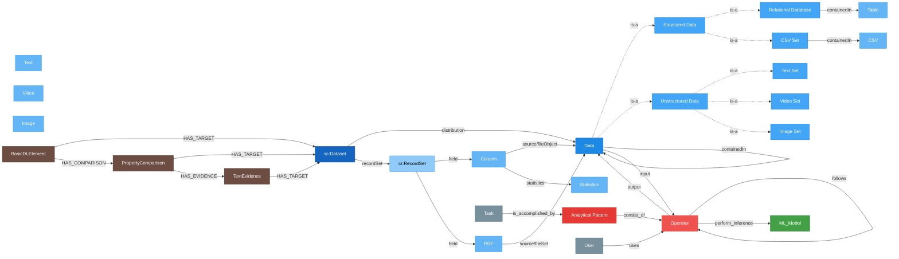

# Service Architecture

The MoMa Management API is a [FastAPI](https://fastapi.tiangolo.com/) service that manages **Metadata Object Model (MoMa)** property graphs stored in [Neo4j](https://neo4j.com/). It sits between external clients (such as the DataGEMS platform or integrating tools) and the Neo4j graph database.

## Layers

The service follows a layered architecture:

```
┌──────────────────────────────────────────────┐
│              HTTP Clients                    │
│  (DataGEMS UI, integrators, CLI)             │
└──────────────┬───────────────────────────────┘
               │ HTTP / REST (port 5000)
┌──────────────▼───────────────────────────────┐
│            FastAPI Application               │
│  ┌──────────┐ ┌────┐ ┌───────┐ ┌──────────┐ │
│  │ Datasets │ │APs │ │ Tasks │ │  Nodes   │ │
│  └────┬─────┘ └─┬──┘ └───┬───┘ └────┬─────┘ │
│  ┌────┘         │        │          │        │
│  │         ┌────┘   ┌────┘     ┌────┘        │
│  │  ┌──────┴────┐   │    ┌─────┴──────┐      │
│  │  │ ML Models │   │    │            │      │
│  │  └─────┬─────┘   │    │            │      │
│  ┌────────▼─────────▼────▼────────────▼───┐  │
│  │           Services layer               │  │
│  │  DatasetService · APService            │  │
│  │  TaskService · NodeService             │  │
│  │  MlModelService                        │  │
│  └──────────────────┬─────────────────────┘  │
│  ┌──────────────────▼─────────────────────┐  │
│  │          Repository layer              │  │
│  │  Neo4jDatasetRepository                │  │
│  │  Neo4jAnalyticalPatternRepository      │  │
│  │  Neo4jTaskRepository · Neo4jNodeRepo   │  │
│  │  Neo4jMlModelRepository                │  │
│  └──────────────────┬─────────────────────┘  │
└─────────────────────┼────────────────────────┘
                      │ Bolt protocol
┌─────────────────────▼────────────────────────┐
│              Neo4j                            │
│  (MoMa property graph + vector index)        │
└──────────────────────────────────────────────┘
```

## Components

### API layer (`moma_management/api/v1/`)

All routes are mounted under the `/v1` prefix via a single router. Four resource groups are exposed:

- **Datasets** – CRUD on dataset subgraphs, Croissant ingestion/conversion, and schema validation.
- **Dataset Relationships** – nested under `/datasets`; records that two datasets were found similar by an external comparison pipeline. Admin-only create/delete, `BROWSE`-on-both-datasets read, one relationship per dataset pair, cascades on dataset deletion.
- **Analytical Patterns** – CRUD on AP subgraphs with natural-language semantic search.
- **Tasks** – Task node creation and AP lookup by task.
- **Nodes** – Retrieval and partial update of individual graph nodes.
- **ML Models** – CRUD on ML_Model nodes (admin-only writes, delete protection when referenced by APs).
- **Health** – A lightweight liveness probe at `/health`.

Authentication and authorization are enforced as FastAPI dependencies injected into each route handler via `require_permission(action)` or `require_authentication()`.

### Services layer (`moma_management/services/`)

- **`DatasetService`** – Orchestrates the conversion of Croissant profiles to PG-JSON, schema validation, and delegates persistence to the repository. On delete, first cascades removal of any `DatasetRelationship` targeting the dataset.
- **`DatasetRelationshipService`** – CRUD for Dataset Relationships: validates both target datasets exist, enforces one relationship per dataset pair (`ConflictError` on duplicates).
- **`AnalyticalPatternService`** – AP CRUD, input-dataset validation, and semantic search (via an embedder).
- **`TaskService`** – Task creation and AP-id lookup.
- **`NodeService`** – Retrieves and patches individual Neo4j nodes.
- **`MlModelService`** – ML_Model CRUD with delete protection (prevents deletion when referenced by analytical patterns).
- **`Embedder` / `LocalEmbedder`** – Produces vector embeddings from AP descriptions using `sentence-transformers` for semantic search.
- **`Authentication`** – Validates RS256 JWTs against JWKS published by the configured OIDC issuer (with in-memory cache). Optionally exchanges tokens using RFC 8693 for scope-specific credentials.
- **`AuthorizationService`** – Delegates per-dataset permission checks to an external permissions gateway over HTTP using the original or exchanged Bearer token.

### Domain layer (`moma_management/domain/`)

- **`MappingEngine`** – Reads `mapping.yml` and transforms Croissant field values into the PG-JSON node/edge structure expected by the MoMa schema.
- **`PgJsonGraph`** – Base Pydantic model for validated PG-JSON graphs, providing edge-constraint enforcement, DFS connectivity checks, and canonical equality.
- **`Dataset`** / **`AnalyticalPattern`** / **`DatasetRelationship`** – Concrete graph models with root-node and structural validation. `DatasetRelationship` additionally enforces that its root links exactly two datasets.
- **`LocalSchemaValidator`** – Validates raw PG-JSON dicts against Draft 7 JSON schemas and returns AJV-style errors.
- **`filters.py`** – Query filter and pagination models.
- **`generated/`** – Pydantic v2 models auto-generated from the JSON Schema files in `schema/` via `make gen`.

### Repository layer (`moma_management/repository/`)

Defines abstract interfaces (`DatasetRepository`, `DatasetRelationshipRepository`, `AnalyticalPatternRepository`, `TaskRepository`, `NodeRepository`, `MlModelRepository`) with Neo4j-backed implementations. All graph I/O uses the official `neo4j` Python driver with PG-JSON serialization helpers provided by `Neo4jPGSONMixin`. The AP repository also manages a Neo4j vector index for semantic search. `DatasetRelationshipRepository` additionally exposes `find_id_for_dataset_pair` (uniqueness check) and `delete_referencing` (cascade delete on dataset removal); the dataset repository's own traversals exclude `HAS_TARGET` so a dataset's subgraph never includes relationship nodes.

## Authentication flow

When a request arrives at a protected endpoint:

```
Client                  API                OIDC Issuer      Permissions Gateway
  │                      │                     │                    │
  │ Authorization: Bearer │                     │                    │
  ├─────────────────────►│                     │                    │
  │     (JWT token)      │                     │                    │
  │                      │ Validate JWT        │                    │
  │                      ├────────────────────►│                    │
  │                      │◄─ Fetch JWKS        │                    │
  │                      │                     │                    │
  │                      │ (Optional) Exchange token                 │
  │                      │ for scope-specific credentials            │
  │                      │                     │                    │
  │                      │ POST /authz/check   │                    │
  │                      ├───────────────────────────────────────►│
  │                      │ with action & dataset ID                 │
  │                      │◄─ Permission granted                     │
  │                      │                    │                    │
  │◄─────────────────────┤                    │                    │
  │  Response            │                    │                    │
```

1. **JWT Validation** – Verifies signature, issuer, audience, and expiration claims.
2. **Token Exchange** – If configured, exchanges the user token for an application-scoped token.
3. **Permission Check** – Queries the gateway to verify authorization for the requested action.

See [Security](security.md) for details.

## Data flow – dataset ingestion

```
Client                Service               Neo4j
  │                      │                    │
  │ POST /datasets        │                    │
  │ (Croissant JSON)      │                    │
  ├─────────────────────►│                    │
  │                      │ MappingEngine      │
  │                      │ converts to PG-JSON│
  │                      ├───────────────────►│
  │                      │  MERGE nodes/edges │
  │◄─────────────────────┤                    │
  │  Dataset (PG-JSON)   │                    │
```

## Graph Data Model

The diagram below shows all MoMa node types and their relationships. Solid arrows are graph edges stored in Neo4j; dashed arrows denote type-hierarchy ("is-a") specialisations.



| Colour | Domain |
|--------|--------|
| 🟦 Blue shades | Dataset & Data nodes |
| 🟥 Red shades | Analytical Pattern & Operators |
| 🟩 Green | ML Model |
| ⬜ Grey | Task & User |
| 🟤 Brown | Dataset Relationship (dataset linking) |

A **Dataset Relationship** ("dataset linking") is a small subgraph produced by an external comparison pipeline — never authored directly by end users — recording that two datasets were found similar. Its root `BasicDLElement` links exactly two `sc:Dataset` nodes; optional `PropertyComparison` children break the similarity down by dataset property (keywords, description, …), each optionally backed by `TextEvidence`. It is treated as a **weak reference**: only admins may create or delete one, reading it requires `BROWSE` on both linked datasets, at most one relationship may exist per dataset pair, and deleting either dataset cascades to delete the relationship.

## External dependencies

| Dependency | Role |
|---|---|
| Neo4j ≥ 5 | Primary graph data store (including vector index for semantic search) |
| OIDC issuer (DataGEMS AAI) | JWT signing keys (JWKS) |
| Permissions gateway | Dataset-level authorization checks |
